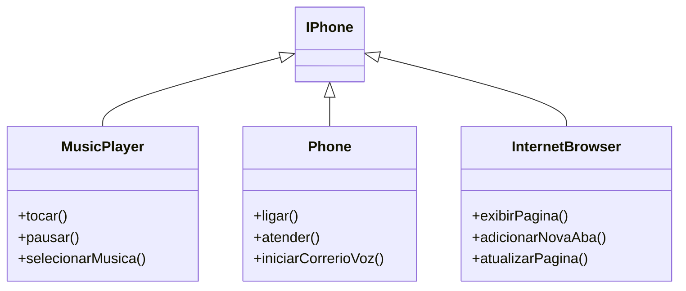

# Repositório para a trilha **Orientação a Objetos e UML** da DIO.

### Diagrama de classes do iPhone

```mermaid
classDiagram
	IPhone <|-- MusicPlayer
	IPhone <|-- Phone
	IPhone <|-- InternetBrowser

	class IPhone {
  }
  
  class MusicPlayer {
    +tocar()
    +pausar()
    +selecionarMusica()
  }
  
  class Phone{
    +ligar()
    +atender()
    +iniciarCorrerioVoz()
  }
  
  class InternetBrowser {
    +exibirPagina()
    +adicionarNovaAba()
    +atualizarPagina()
  }
```
